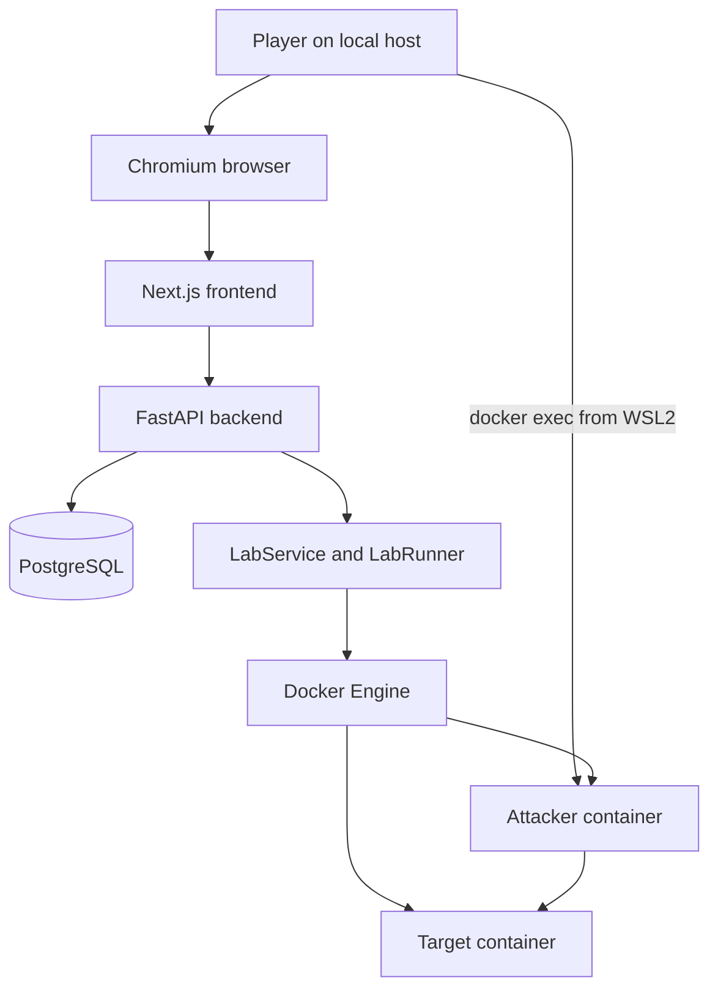
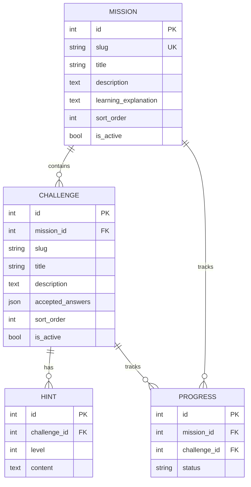

# OffSec Lab v0.1 Basic Design

## 1. Purpose and status

This document records the implemented OffSec Lab v0.1 architecture. It replaces
earlier prospective examples in this file with the system that exists after
ISSUE-002 through ISSUE-027. It does not redesign the MVP.

OffSec Lab v0.1 is a local, single-user cyber range. A browser-based management
application presents learning content and controls a Docker-based reconnaissance
Lab. The intentionally observable target remains separated from the management
application and from normal external networks.

Related decisions:

- [ADR-001](adr/ADR-001-wsl-hosted-backend.md) is superseded.
- [ADR-002](adr/ADR-002-Containerized-Management-Plane.md) establishes the
  containerized management plane.
- [ADR-003](adr/ADR-003-internal-lab-network.md) establishes the internal Lab
  network.
- [ADR-004](adr/ADR-004-postgresql.md) selects PostgreSQL.
- [ADR-005](adr/ADR-005-external-terminal.md) selects an external terminal.
- [ADR-006](adr/ADR-006-backend-docker-socket-mvp-exception.md) accepts the
  backend-only Docker socket risk for the local v0.1 MVP.

## 2. System context



The player uses the browser for mission content, progress, answers, and Lab
lifecycle controls. The player uses a separate WSL2 terminal to run tools inside
the attacker container. There is no browser terminal in v0.1.

## 3. Deployment topology

The supported host is Windows 11 with WSL2 Ubuntu and Docker Desktop's Linux
engine. The root `docker-compose.yml` builds and starts all three management
services:

```text
Host loopback
  127.0.0.1:${FRONTEND_PORT:-3000} -> frontend:3000
  127.0.0.1:${BACKEND_PORT:-8000}  -> backend:8000

Docker management network
  frontend <-> backend <-> db:5432

Docker Lab network (separate project)
  offsec-m01-attacker <-> offsec-m01-net <-> target-m01
```

PostgreSQL has no published host port. The frontend and backend listen on all
interfaces inside their containers but Compose publishes them only on host
loopback. The frontend rewrites `/api/v1/*` to `http://backend:8000` in the
Compose build. Browser traffic therefore remains same-origin.

The management network and `offsec-m01-net` are distinct Docker networks. No
management service joins the Lab network, and neither Lab container joins the
management network.

## 4. Components and responsibilities

### 4.1 Frontend

Technology: Next.js 16, React 19, and TypeScript.

Responsibilities:

- render Dashboard, Learning Path, Progress, Mission Briefing, Lab Workspace,
  staged Hint, and Mission Complete views;
- call the backend through same-origin `/api/v1/*` routes;
- display authoritative Lab and learning progress returned by the backend;
- collect an answer and display the backend result; and
- confirm destructive Lab reset before sending the request.

The frontend does not contain accepted answers, determine completion, authorize
arbitrary Labs, or control Docker directly.

Implemented routes:

| Route | Purpose |
| --- | --- |
| `/` | Redirect to `/dashboard` |
| `/dashboard` | Current learning and Lab overview |
| `/learning-path` | Mission list and status |
| `/progress` | Saved mission/challenge progress |
| `/missions/{missionId}` | Mission briefing |
| `/missions/{missionId}/lab` | Lab controls, target, challenges, hints, answers |

### 4.2 Backend API

Technology: Python 3.12 and FastAPI.

The backend uses thin API handlers over services and repositories:

```text
API -> Service -> Repository -> PostgreSQL
API -> LabService -> DockerComposeLabRunner -> Docker CLI
```

Main endpoints:

| Method and path | Responsibility |
| --- | --- |
| `GET /health` | Process liveness |
| `GET /ready` | PostgreSQL readiness |
| `GET /api/v1/missions` | Active mission summaries |
| `GET /api/v1/missions/{mission_id}` | Mission content, ordered challenges, hints |
| `POST /api/v1/challenges/{challenge_id}/answers` | Backend-only answer validation and progress update |
| `GET /api/v1/progress` | Mission and challenge progress |
| `GET /api/v1/labs/{mission_id}/status` | Runtime state and target address |
| `POST /api/v1/labs/{mission_id}/start` | Start the registered Lab |
| `POST /api/v1/labs/{mission_id}/stop` | Stop its containers without deleting them |
| `POST /api/v1/labs/{mission_id}/reset` | Remove and recreate the Lab |

Client-facing failures use structured, sanitized errors. Docker command output,
stack traces, environment secrets, and host paths are not returned to the
browser.

### 4.3 PostgreSQL

PostgreSQL 17 stores learning content and progress. Alembic migrations reproduce
the schema and `python -m app.seed` creates or updates the fixed Mission 01
content without resetting existing progress.



Accepted answers remain in the backend/database and are excluded from public
response schemas. Progress statuses are `LOCKED`, `AVAILABLE`, and `COMPLETED`.
Mission status is derived as `NOT_STARTED`, `IN_PROGRESS`, or `COMPLETED`.

### 4.4 Lab Controller

`LAB_REGISTRY` contains only numeric Mission ID 1. It fixes:

- Compose file `challenges/m01-recon/compose.lab.yml`;
- Compose project `offsec-m01`;
- services `attacker` and `target`;
- target container `target-m01`; and
- network `offsec-m01-net`.

The caller cannot provide a Compose path, Docker arguments, image, container
name, or shell command. The runner uses `asyncio.create_subprocess_exec` with an
argument array, fixed operation methods, a per-process timeout, sanitized
errors, and a lock around lifecycle operations.

### 4.5 Mission 01 Lab

The attacker image is Debian-based and includes `ping`, `nmap`, `curl`, and
supporting network tools. It runs as UID/GID 1000 (`trainee`). The target runs
SSH and HTTP as an unprivileged `target` user for reconnaissance and version
enumeration. SSH authentication is disabled; its host key is generated in
ephemeral `/tmp` storage.

The target's TCP/22 and TCP/80 are internal training services. They are not
published host ports.

## 5. Communication paths

### Browser to application

```text
Browser -> 127.0.0.1:3000 -> frontend
frontend rewrite -> backend:8000 -> FastAPI
FastAPI -> db:5432 -> PostgreSQL
```

The backend is also available on `127.0.0.1:8000` for local health checks and
API diagnostics. No CORS wildcard is needed for normal UI use because browser
API requests are same-origin through the frontend.

### Backend to Docker

```text
Lab API -> LabService -> registered LabDefinition
        -> DockerComposeLabRunner -> Docker CLI -> Docker socket -> Docker Engine
```

The Docker socket boundary grants host-equivalent authority. ADR-006 accepts
this for local v0.1 only. The repository is mounted read-only at `/workspace` so
the backend can reach the registered Compose file and build contexts.

### Player to target

```text
WSL2 terminal -> docker exec -it offsec-m01-attacker bash
attacker -> offsec-m01-net -> target-m01:22,80
```

The browser and host do not connect directly to the target services.

## 6. Network and container security

| Boundary/control | Implemented state |
| --- | --- |
| Management frontend | Host binding `127.0.0.1:${FRONTEND_PORT:-3000}` |
| Management backend | Host binding `127.0.0.1:${BACKEND_PORT:-8000}` |
| PostgreSQL | Management network only; no host port |
| Lab network | Bridge, `internal: true`, `attachable: false` |
| Attacker/target membership | Lab network only |
| Target ports | `expose` 22 and 80; no `ports` mapping |
| Lab root filesystems | Read-only |
| Lab writable storage | Bounded `/tmp` tmpfs with `noexec,nosuid,nodev` |
| Lab capabilities | Drop all; attacker adds `NET_RAW`, target adds `NET_BIND_SERVICE` |
| Privilege/namespace | Non-privileged, `no-new-privileges`, no host network/PID/IPC |
| Lab host mounts | None |
| Lab Docker socket | None |

The frontend image also runs as a non-root `app` user and receives no socket or
host bind mount. The backend runs as non-root `app`, is non-privileged, and uses
`no-new-privileges`, but its socket supplementary group grants the accepted
host-equivalent Docker authority.

## 7. Lab lifecycle

### Start

```text
POST start
  -> validate numeric mission ID through LAB_REGISTRY
  -> inspect running services
  -> docker compose up -d --wait (unless already healthy)
  -> RUNNING
```

Start is idempotent for an already healthy Lab. The API returns whether it was
already running.

### Status and interaction

`GET status` derives the state from the in-memory operation marker plus Docker's
actual service and target-health state. A complete, healthy project returns
`RUNNING` with the target hostname and dynamic internal IP. Partial services,
unhealthy target, missing network/IP, or Docker errors result in `ERROR`.

The state vocabulary is `STOPPED`, `STARTING`, `RUNNING`, `STOPPING`, and
`ERROR`. While running, the player uses the attacker container, submits answers
through the UI, reveals persisted hints in order, and advances backend-managed
progress.

### Stop

```text
POST stop -> docker compose stop -> STOPPED
```

Stop leaves the Lab containers in place and is idempotent when nothing is
running.

### Reset

```text
POST reset
  -> docker compose down --volumes
  -> docker compose up -d --force-recreate --wait
  -> RUNNING
```

Reset recreates only the registered Lab project's containers, network, and Lab
volumes. It does not erase PostgreSQL learning progress.

## 8. Trust boundaries and accepted risk

```text
Local browser / host
        |
        | loopback publication
        v
Frontend -> Backend -> PostgreSQL
               |
               | ADR-006: host-equivalent authority
               v
          Docker socket / Engine
               |
               | creates isolated Lab project
               v
      Attacker ----internal network----> Target
```

Primary trust assumptions:

- the host, WSL2, Docker Desktop, and local user are trusted;
- the unauthenticated API remains loopback-only and single-user;
- only fixed registry entries reach the Docker runner;
- Lab containers are untrusted training workloads and never receive management
  credentials, host binds, or Docker authority; and
- no production or Internet deployment uses this v0.1 architecture.

The backend Docker socket is a genuine accepted risk. Non-root execution,
loopback API exposure, fixed operations, argument-array subprocesses, timeouts,
sanitized errors, and a read-only repository bind reduce the attack surface but
do not remove the socket's host authority. LAN/Internet exposure, multi-user
operation, or broader Docker control requires a new ADR, threat model, and a
narrow host controller or restricted proxy.

## 9. Testing architecture

The implemented verification layers are:

- backend unit tests for services and runner behavior;
- API tests for successful, invalid, locked, unknown, and failure paths;
- a real PostgreSQL migration, seed, repository, and API suite;
- static Compose and Dockerfile security tests;
- real Lab integration covering Start, status, attacker-to-target discovery,
  service enumeration, Reset, progress preservation, Stop, and cleanup;
- frontend component and real API-client integration tests; and
- a real Chromium end-to-end Mission 01 flow.

Exact executed commands and results are maintained in the
[Phase 9 test report](../testing/phase9-test-report.md). Security assessment
method, dynamic evidence, accepted risk, and residual risks are maintained in
the [v0.1 Security Assessment](../security/security-assessment-v0.1.md).

## 10. Deferred architecture

v0.1 has no authentication, multi-user authorization, browser terminal, remote
Lab access, telemetry, cloud deployment, Kubernetes, multiplayer, AI Mentor,
XP/level/skill-tree system, or additional vulnerability Labs. These are future
scope and must not inherit ADR-006 or the local unauthenticated trust model
without explicit architecture and security review.
