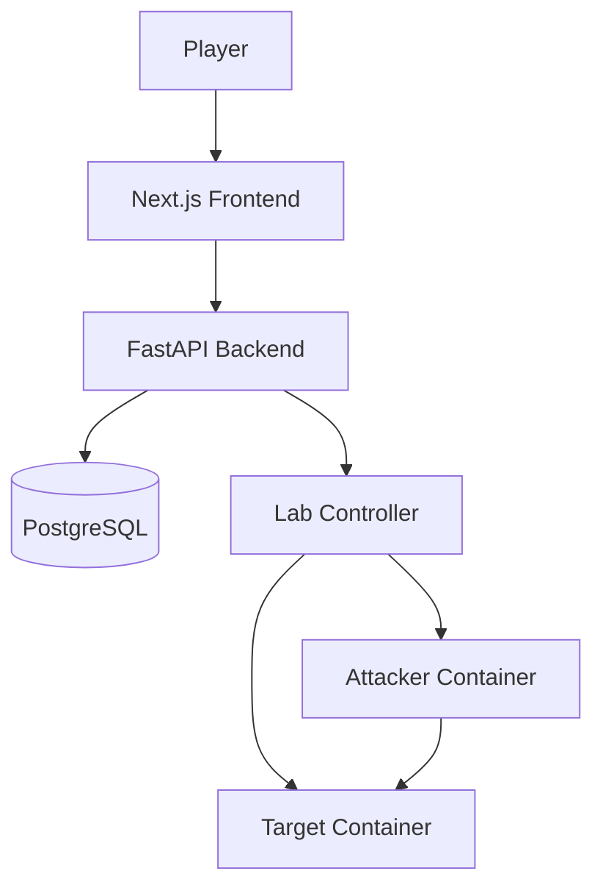
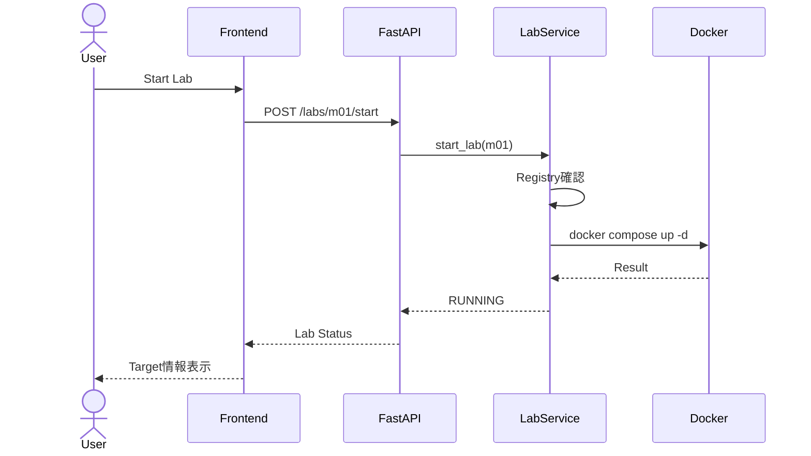
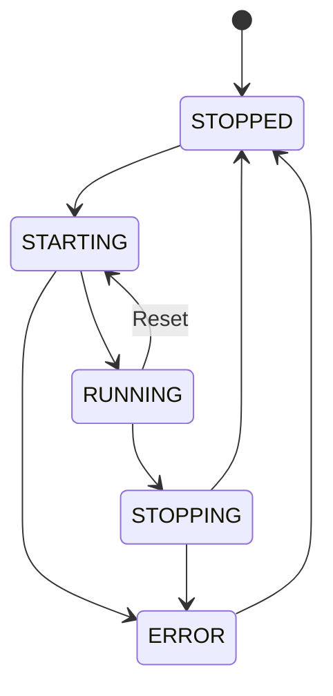
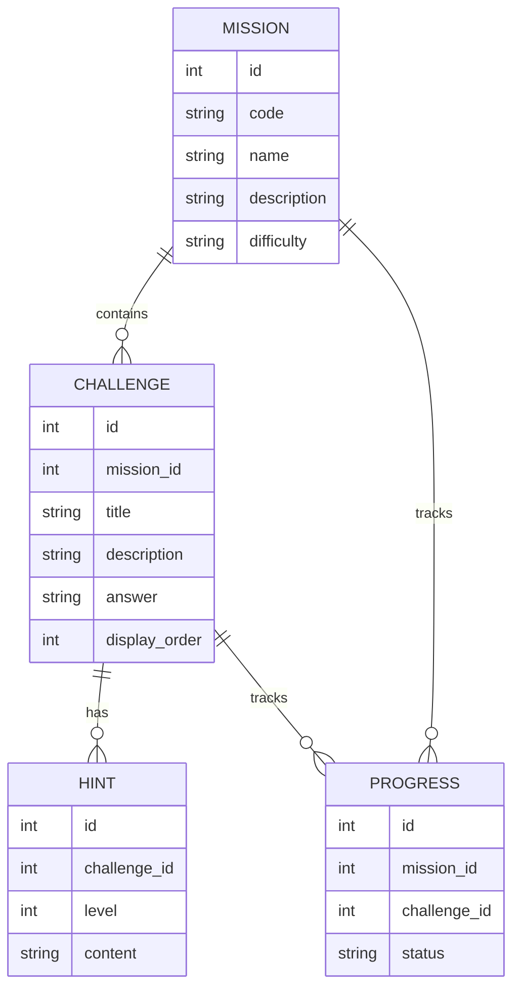
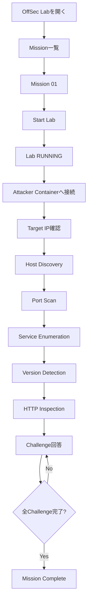

# OffSec Lab v0.1 基本設計書

## 1. 文書概要

### 1.1 文書名

OffSec Lab v0.1 基本設計書

### 1.2 対象バージョン

**OffSec Lab v0.1**

### 1.3 目的

本書は、OffSec Lab v0.1 MVP要件を実現するためのシステム構成、コンポーネント、画面、API、データ、Lab環境、セキュリティ、および主要な処理方式を定義する。

本書確定後、詳細設計およびCodexによる実装へ移行する。

---

# 2. 設計方針

OffSec Lab v0.1では以下を基本方針とする。

1. ローカル環境専用とする
2. 単一ユーザーを前提とする
3. 脆弱なTargetはDocker内部へ隔離する
4. TargetのPortはHostへ公開しない
5. AttackerからのみTargetへアクセスさせる
6. Docker SocketをApplication ContainerへMountしない
7. Docker操作は定義済みMissionのみ許可する
8. Challenge追加を容易にする
9. MVPではMicroservices化しない
10. Vertical Sliceで開発する

---

# 3. システム全体構成

## 3.1 Logical Architecture



---

# 4. Physical Architecture

v0.1ではWindows 11 + WSL2 + Docker Desktopを標準開発環境とする。

```text
Windows 11
│
├── Browser
│     │
│     └── http://localhost:3000
│
└── WSL2 / Ubuntu
      │
      ├── Next.js
      │
      ├── FastAPI
      │
      ├── Git
      │
      ├── Codex
      │
      └── Docker CLI
              │
              ▼
         Docker Desktop
              │
              ├── PostgreSQL
              │
              └── OffSec Lab Network
                    │
                    ├── attacker-m01
                    │
                    └── target-m01
```

---

# 5. Control Plane / Lab Plane分離

OffSec Labではシステムを2つの領域に分ける。

## Control Plane

ゲームそのものを管理する領域。

構成：

- Frontend
- Backend
- PostgreSQL
- Mission Engine
- Progress Management
- Lab Controller

Control Planeは、

「Missionを開始する」

「回答を判定する」

「進捗を保存する」

などを担当する。

---

## Lab Plane

実際のセキュリティ演習を行う領域。

構成：

```text
Docker Internal Network

├── attacker
└── target
```

プレイヤーによる、

```text
Recon
Enumeration
Exploitation
```

などは原則Lab Plane内部で実施する。

---

# 6. Frontend Architecture

## 6.1 Technology

```text
Next.js
TypeScript
```

---

## 6.2 Responsibility

Frontendは以下を担当する。

- Mission一覧
- Mission詳細
- Challenge表示
- Hint表示
- 回答入力
- Lab操作
- Lab Status表示
- Progress表示
- Mission Complete表示

セキュリティ判定や正解判定をFrontendのみで行ってはならない。

---

# 7. Page Structure

```text
/
│
├── /missions
│
├── /missions/[missionId]
│
└── /missions/[missionId]/complete
```

---

# 8. Home Page

URL：

```text
/
```

表示：

```text
OffSec Lab

Learn Offensive Security by Doing

[Start Learning]
```

v0.1では簡素なLanding Pageとする。

---

# 9. Mission List

URL：

```text
/missions
```

表示例：

```text
┌─────────────────────────────┐
│ Mission 01                  │
│                             │
│ Reconnaissance              │
│                             │
│ Difficulty: Easy            │
│                             │
│ Status: Not Started         │
│                             │
│       [View Mission]        │
└─────────────────────────────┘
```

---

# 10. Mission Detail

URL：

```text
/missions/1
```

主要UI：

```text
Mission 01
Reconnaissance

Scenario
────────────────────

You have been assigned to perform
an initial security assessment...

Learning Objectives
────────────────────

・Host Discovery
・Port Scan
・Service Enumeration
・Version Detection

Lab Status
────────────────────

STOPPED

[Start Lab]


Target
────────────────────

Available after Lab Start


Challenges
────────────────────

01 Host Discovery
02 Port Scan
03 Service Enumeration
04 Version Detection
05 HTTP Inspection
```

---

# 11. Active Mission

Lab起動後：

```text
Lab Status

● RUNNING


Target

172.x.x.x


Enter Attacker Environment

./scripts/enter-lab.sh m01
```

v0.1ではBrowser内Terminalを実装しない。

ユーザーはWSL TerminalからAttacker Containerへ入る。

---

# 12. Attacker接続方式

ユーザーが、

```bash
./scripts/enter-lab.sh m01
```

を実行する。

内部処理例：

```bash
docker exec -it offsec-m01-attacker bash
```

Windows PowerShell利用向けには将来的に、

```text
enter-lab.ps1
```

も提供可能とする。

v0.1ではWSL2用Shell Scriptを標準とする。

---

# 13. Backend Architecture

## 13.1 Technology

```text
Python
FastAPI
```

---

# 14. Backend Layer Structure

以下の責務分離を採用する。

```text
API Layer
    ↓
Service Layer
    ↓
Repository Layer
    ↓
Database
```

Lab操作のみ別途、

```text
API
 ↓
Lab Service
 ↓
Lab Runner
 ↓
Docker CLI
```

とする。

---

# 15. Backend Directory Structure

初期案：

```text
backend/

app/
├── main.py
│
├── api/
│   ├── missions.py
│   ├── challenges.py
│   ├── progress.py
│   └── labs.py
│
├── models/
│   ├── mission.py
│   ├── challenge.py
│   ├── hint.py
│   └── progress.py
│
├── schemas/
│
├── services/
│   ├── mission_service.py
│   ├── challenge_service.py
│   ├── progress_service.py
│   └── lab_service.py
│
├── repositories/
│
├── lab/
│   ├── runner.py
│   └── registry.py
│
├── db/
│
└── core/
```

---

# 16. Docker Control Design

本プロジェクトで最も重要な設計項目の一つとする。

## 採用方式

FastAPI Backendは **WSL2 Host側で実行する**。

BackendからDocker CLIを利用してMission用Labを操作する。

```text
FastAPI
   │
   ▼
LabService
   │
   ▼
LabRunner
   │
   ▼
Docker CLI
   │
   ▼
Mission Compose
```

---

# 17. Docker Socketを使用しない理由

以下の構成は採用しない。

```text
Backend Container
      │
      ▼
/var/run/docker.sock
      │
      ▼
Docker Engine
```

Docker Socketへのアクセス権を持つContainerは、実質的にHost上で強い権限を取得できる可能性がある。

意図的に脆弱なシステムを扱うOffSec Labでは、この構成を避ける。

---

# 18. Lab Runner

Backendは直接自由なShell Commandを実行しない。

専用のLab Runnerを用意する。

例：

```python
start_lab("m01")
stop_lab("m01")
reset_lab("m01")
get_lab_status("m01")
```

のみ公開する。

ユーザーから任意のCompose File名やCommandを指定できないようにする。

---

# 19. Mission Registry

実行可能なMissionはRegistryで管理する。

概念例：

```python
LAB_REGISTRY = {
    "m01": {
        "compose_file": "challenges/m01/compose.lab.yml",
        "project_name": "offsec-m01"
    }
}
```

APIから受け取ったMission IDはRegistryと照合する。

Registryに存在しないMissionは起動しない。

---

# 20. Command Execution Policy

Docker Command実行時は、

```python
subprocess.run(...)
```

等を使用する。

以下は禁止する。

```python
shell=True
```

ユーザー入力値をCommand文字列へ直接連結しない。

例：

悪い設計：

```python
os.system(
    "docker compose -f " + user_input
)
```

採用しない。

Mission IDからServer側でCompose Fileを決定する。

---

# 21. Lab Start Sequence



---

# 22. Lab Stop Sequence

```text
POST /labs/m01/stop
        ↓
Registry Validation
        ↓
docker compose down
        ↓
STOPPED
```

---

# 23. Lab Reset Sequence

```text
Reset
 ↓
docker compose down -v
 ↓
docker compose up -d
 ↓
Health Check
 ↓
RUNNING
```

Volumeを利用するChallengeの場合、

```text
-v
```

により状態を削除する。

ただし永続化が必要なLabではMission単位でReset方式を定義する。

---

# 24. Lab State Machine



---

# 25. Lab Status

内部状態：

```text
STOPPED
STARTING
RUNNING
STOPPING
ERROR
```

v0.1では状態をBackend memory + Docker実状態から判定する。

将来的にはJob管理方式への変更を検討する。

---

# 26. Lab Network

Missionごとに独立Networkを作成する。

Mission 01：

```text
offsec-m01-net
```

構成：

```text
offsec-m01-net

├── attacker-m01
└── target-m01
```

---

# 27. Network Isolation

Mission NetworkではDockerの、

```yaml
internal: true
```

を原則利用する。

概念：

```yaml
networks:

  lab:
    internal: true
```

これによりLab Containerから外部ネットワークへの不要な接続を制限する。

---

# 28. Host Port Policy

Targetについて、

```yaml
ports:
```

は原則使用しない。

つまり、

```text
Host
   X
Target:80
```

とする。

アクセス可能なのは、

```text
Attacker
   ↓
Target:80
```

のみ。

---

# 29. Target IP

Dockerによる動的IPを使用する。

固定IPはMVPでは採用しない。

理由：

- Subnet collision回避
- Docker管理へ委譲
- 環境依存を削減

Backendは、

```text
docker inspect
```

等でTarget IPを取得する。

取得したIPをFrontendへ返す。

---

# 30. Target Name

Docker DNS上では、

```text
target-m01
```

を使用可能とする。

プレイヤーには学習目的からTarget IPを基本表示する。

---

# 31. Mission 01 Lab

Mission 01：

```text
Reconnaissance
```

Container：

```text
attacker-m01

target-m01
```

---

# 32. Attacker Container

Base：

```text
Debian 12 (bookworm-slim)
```

搭載ツール：

```text
bash
iproute2
iputils-ping
nmap
curl
dnsutils
```

必要なツールはImage Build時に導入する。

Lab実行中にInternetからパッケージを取得する設計にはしない。

実行ユーザーは非rootの `trainee`（UID/GID 1000）とする。Root filesystemは
read-onlyとし、一時ファイル用に `/tmp` のみtmpfsとして書込み可能にする。

---

# 33. Attacker Privileges

原則：

```text
privileged: false
```

とする。

Mission 01では全Linux capabilityを削除し、Host Discoveryに必要な
`NET_RAW` のみ追加する。`no-new-privileges` を有効にし、Docker Socket、
Host Network、Host directory mountは使用しない。

Resource上限はCPU 0.5、Memory 256MB、PID 128とする。

---

# 34. Target Container

Mission 01 Targetでは、

```text
22/tcp SSH
80/tcp HTTP
```

をListenさせる。

Targetは意図した情報だけをEnumeration可能とする。

Targetは非rootユーザーで実行し、Root filesystemをread-onlyとする。
全Linux capabilityを削除した上で、22/tcpおよび80/tcpのListenに必要な
`NET_BIND_SERVICE` のみ追加する。Resource上限はCPU 0.25、Memory 128MB、
PID 64とする。

---

# 35. Target HTTP Service

HTTPサービスでは以下を取得可能とする。

```text
HTTP Status
Server Header
Page Title
Response Body
```

Mission 01ではWeb Vulnerability Exploitationは行わない。

目的はEnumerationである。

---

# 36. Target SSH Service

SSH Serviceは、

```text
Port Detection
Service Detection
Version Detection
```

を目的として配置する。

Mission 01ではCredential AttackやSSH Loginを行わない。

Password、Public Key、Keyboard Interactiveによる認証を無効化する。
SSH Host KeyはContainer起動時にtmpfsへ生成し、ImageやRepositoryへ保存しない。

---

# 37. Database

## Technology

```text
PostgreSQL
```

v0.1でも採用する。

理由：

Mission追加時の拡張性と、Web Application開発・Database設計をポートフォリオとして扱うため。

---

# 38. Entity Relationship



---

# 39. Answer Storage

Challenge AnswerをFrontendへ返してはならない。

正解はBackendまたはDatabase内で保持する。

API：

```text
GET /missions/1
```

では正解値を返さない。

回答判定：

```text
POST /challenges/1/answer
```

Backend側でのみ実施する。

---

# 40. Answer Normalization

v0.1では簡単なNormalizationを実施する。

例：

```text
80
"80"
80/tcp
```

等についてChallengeごとに許容値を定義できるようにする。

完全な自由回答評価はv0.1では行わない。

---

# 41. Progress

Challenge Status：

```text
LOCKED
AVAILABLE
COMPLETED
```

Mission Status：

```text
NOT_STARTED
IN_PROGRESS
COMPLETED
```

---

# 42. Challenge Unlock

Mission 01ではSequential方式とする。

```text
Challenge 01
     ↓
Challenge 02
     ↓
Challenge 03
     ↓
Challenge 04
     ↓
Challenge 05
```

前Challenge完了後に次ChallengeをAVAILABLEとする。

---

# 43. Hint Design

Hint：

```text
Level 1
Concept

Level 2
Technique / Tool

Level 3
Command Example
```

Hint利用によるXP減点等はv0.1では実装しない。

---

# 44. API Design

Base URL：

```text
/api/v1
```

---

# 45. Mission API

```text
GET /api/v1/missions
```

Mission一覧。

```text
GET /api/v1/missions/{mission_id}
```

Mission詳細。

---

# 46. Challenge API

```text
POST /api/v1/challenges/{challenge_id}/answers
```

Request：

```json
{
  "answer": "80"
}
```

Response：

```json
{
  "correct": true,
  "status": "COMPLETED",
  "next_challenge_id": 3,
  "mission_status": "IN_PROGRESS"
}
```

`status` は回答対象Challengeの更新後状態、`next_challenge_id` は次に
`AVAILABLE` となるChallengeを表す。全必須Challenge完了時は
`mission_status` を `COMPLETED` とする。

---

# 47. Progress API

```text
GET /api/v1/progress
```

Mission / Challenge進捗を返す。

Response例：

```json
{
  "missions": [
    {
      "mission_id": 1,
      "status": "IN_PROGRESS",
      "challenges": [
        {
          "challenge_id": 1,
          "status": "COMPLETED"
        },
        {
          "challenge_id": 2,
          "status": "AVAILABLE"
        },
        {
          "challenge_id": 3,
          "status": "LOCKED"
        }
      ]
    }
  ]
}
```

正解時の進捗更新はMission単位のTransactionとして処理し、同時回答でも
Challengeの順次解放が崩れないようMission行をLockする。

---

# 48. Lab API

```text
POST /api/v1/labs/{mission_code}/start

POST /api/v1/labs/{mission_code}/stop

POST /api/v1/labs/{mission_code}/reset

GET /api/v1/labs/{mission_code}/status
```

---

# 49. Lab Status Response

例：

```json
{
  "mission_code": "m01",
  "status": "RUNNING",
  "target": {
    "hostname": "target-m01",
    "ip": "172.20.0.3"
  }
}
```

---

# 50. Health Check

Backend：

```text
GET /health
```

Response：

```json
{
  "status": "ok"
}
```

---

# 51. Error Format

API Errorは共通形式とする。

```json
{
  "error": {
    "code": "LAB_START_FAILED",
    "message": "Failed to start the lab."
  }
}
```

内部CommandやStack TraceをFrontendへそのまま返さない。

---

# 52. Logging

Backendは最低限以下を記録する。

```text
timestamp
level
event
mission_code
result
```

例：

```text
INFO LAB_START mission=m01 result=success
```

Credentialや秘密情報はLogへ出さない。

---

# 53. Security Boundary

最重要Boundary：

```text
Internet
    X
Lab Target
```

Targetへ外部から直接アクセスできないこと。

---

# 54. Backend Exposure

FastAPIは原則、

```text
127.0.0.1
```

へBindする。

例：

```text
127.0.0.1:8000
```

LANへ公開しない。

---

# 55. Frontend Exposure

Next.jsも開発時は、

```text
localhost
```

利用を基本とする。

LAN公開はv0.1対象外。

---

# 56. CORS

Backendは許可Originを限定する。

例：

```text
http://localhost:3000
```

Wildcard：

```text
*
```

は使用しない。

---

# 57. Secret Management

Repository：

```text
.env.example
```

のみCommitする。

以下：

```text
.env
```

は`.gitignore`対象とする。

Missionでは実在Credentialを使用しない。

---

# 58. Docker Security

Lab Containerでは原則以下を禁止する。

```text
privileged: true

network_mode: host

/var/run/docker.sock

Host root directory mount

実Credential
```

---

# 59. Resource Limit

Challenge Container暴走対策として、将来的には、

```text
CPU
Memory
PID
```

制限を設定する。

v0.1でも実装可能な範囲でMemory / CPU制限を導入する。

---

# 60. Challenge Directory Design

```text
challenges/

└── m01-recon/
    │
    ├── compose.lab.yml
    │
    ├── attacker/
    │   └── Dockerfile
    │
    ├── target/
    │   ├── Dockerfile
    │   └── files/
    │
    └── README.md
```

Mission追加時はこの単位で追加する。

---

# 61. Repository Structure

最終的なv0.1想定：

```text
offsec-lab/

├── frontend/
│
├── backend/
│
├── challenges/
│   └── m01-recon/
│
├── docs/
│   ├── planning/
│   ├── requirements/
│   ├── design/
│   ├── security/
│   └── testing/
│
├── scripts/
│   └── enter-lab.sh
│
├── tests/
│
├── AGENTS.md
├── README.md
├── .gitignore
└── .env.example
```

---

# 62. Mission 01 User Flow



---

# 63. Mission 01 Challenge Definition

## Challenge 01

Host Discovery

目的：

Targetへの到達性を確認する。

主なツール：

```text
ping
```

---

## Challenge 02

Port Scan

目的：

Attack SurfaceとなるOpen Portを確認する。

主なツール：

```text
nmap
```

---

## Challenge 03

Service Enumeration

目的：

各Port上のServiceを特定する。

主なツール：

```text
nmap -sV
```

---

## Challenge 04

Version Detection

目的：

Service Versionを確認する。

---

## Challenge 05

HTTP Inspection

目的：

Web Serverの基本情報を調査する。

主なツール：

```text
curl
```

---

# 64. Mission Complete

全Challenge：

```text
COMPLETED
```

になった場合、

Mission：

```text
COMPLETED
```

へ更新する。

Frontend：

```text
MISSION COMPLETE
```

画面へ遷移する。

---

# 65. Reset Behavior

Reset時、

```text
Lab Container削除
↓
Lab Network削除
↓
Container再作成
↓
Network再作成
↓
Health Check
↓
RUNNING
```

Challenge ProgressについてはResetしない。

Lab ResetとLearning Progress Resetは別概念とする。

---

# 66. Failure Handling

Docker起動失敗：

```text
ERROR
```

とする。

Frontendには、

```text
Lab could not be started.
Check Docker and try again.
```

等を表示する。

内部Command出力はBackend Logへ保存する。

---

# 67. Testing Architecture

Testを以下に分類する。

```text
Unit
│
├── Mission Service
├── Challenge Service
├── Progress Service
└── Lab Registry

API
│
├── Mission API
├── Challenge API
└── Lab API

Integration
│
├── Database
└── Docker Lab

E2E
│
└── Mission 01
```

---

# 68. Security Test

最低限以下を確認する。

```text
Target Host Port非公開

Target Internet非接続

Docker Socket非Mount

privileged=false

不要Volumeなし

Backend localhost限定

CORS限定

Secret未Commit
```

---

# 69. Development Architecture

実装はIssue単位とする。

```text
main
 │
 └── feature/issue-XXX
          │
          ├── Codex Implementation
          ├── Test
          ├── Human Review
          └── Merge
```

---

# 70. Codex Implementation Policy

CodexはIssue開始前に以下を読む。

```text
AGENTS.md

docs/requirements/mvp_requirements_v0.1.md

docs/design/basic_design_v0.1.md
```

必要な範囲のみ変更する。

---

# 71. Architecture Decision — ADR候補

重要な設計判断はADRとして残す。

初期ADR：

```text
ADR-001
Use WSL-hosted Backend for Docker Control

ADR-002
Do Not Mount Docker Socket Into Application Containers

ADR-003
Use Docker Internal Network for Vulnerable Labs

ADR-004
Use PostgreSQL for MVP

ADR-005
Use External Terminal Instead of Browser Terminal
```

保存先候補：

```text
docs/design/adr/
```

---

# 72. v0.1対象外

以下は本設計の対象外。

```text
Authentication

Multiple Users

Cloud Deployment

Internet Hosting

Browser Terminal

AI Mentor

XP

Skill Tree

Ranking

SQL Injection Lab

XSS Lab

IDOR Lab

Privilege Escalation

Active Directory

Multiplayer
```

---

# 73. 将来拡張

v0.2以降、

```text
Mission 02
Web Enumeration

Mission 03
SQL Injection

Mission 04
XSS

Mission 05
IDOR
```

等を、

```text
challenges/
```

へ追加可能な構造とする。

Platform側の変更量を可能な限り小さくする。

---

# 74. MVP完成条件

以下がEnd-to-Endで成立すること。

```text
OffSec Lab起動
        ↓
Mission 01表示
        ↓
Mission詳細
        ↓
Start Lab
        ↓
Docker Lab生成
        ↓
Target IP表示
        ↓
Attacker接続
        ↓
Nmap
        ↓
Service Enumeration
        ↓
Challenge回答
        ↓
Progress保存
        ↓
Mission Complete
        ↓
Stop / Reset
```

この状態を、

**OffSec Lab v0.1 Architecture Complete**

および実装開始可能状態とする。

---

# 75. 基本設計上の最重要決定

OffSec Lab v0.1では以下をArchitecture Baselineとする。

```text
Frontend
Next.js / TypeScript

Backend
FastAPI / Python

Database
PostgreSQL

Lab
Docker / Docker Compose

Execution Environment
Windows 11 + WSL2

Docker Control
WSL2上のBackend → Docker CLI

Lab Isolation
Docker internal network

Attacker Access
docker exec

Target Exposure
Host Port公開なし

Docker Socket
Application ContainerへMount禁止

Users
Single User

Terminal
External Terminal

Deployment
Local Only
```

このBaselineを変更する場合は、理由をADRへ記録する。
